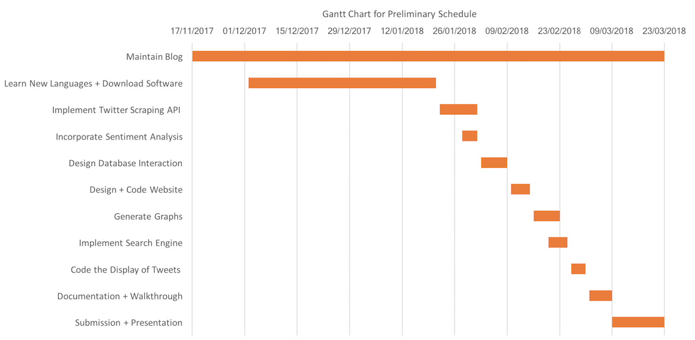

- [Table of Contents](#table-of-contents)
- [1. Introduction](#1-introduction)
  * [1.1 Overview](#11-overview)
  * [1.2 Business Context](#12-business-context)
  * [1.3 Glossary](#13-glossary)
- [2. General Description](#2-general-description)
  * [2.1 Product / System Functions](#21-product---system-functions)
  * [2.2 User Characteristics and Objectives](#22-user-characteristics-and-objectives)
  * [2.3 Operational Scenarios](#23-operational-scenarios)
    + [2.3.1 Navigation of general UI](#231-navigation-of-general-ui)
    + [2.3.2 Navigation to specific information](#232-navigation-to-specific-information)
    + [2.3.3 Navigation to tweets based on terms](#233-navigation-to-tweets-based-on-terms)
    + [2.3.4 Saving relevant graphs](#234-saving-relevant-graphs)
  * [2.4 Constraints](#24-constraints)
    + [2.4.1 Tweet Availability Constraint](#241-tweet-availability-constraint)
    + [2.4.1 Time Constraint](#241-time-constraint)
- [3. Functional Requirements](#3-functional-requirements)
  * [3.1 Web User Interface](#31-web-user-interface)
  * [3.2 Twitter Web Scraping](#32-twitter-web-scraping)
  * [3.3 Sentiment Analysis](#33-sentiment-analysis)
  * [3.4 Database Interaction](#34-database-interaction)
  * [3.5 Search Term/Twitter Hashtag](#35-search-term-twitter-hashtag)
  * [3.6 Generating Statistics and Graphs](#36-generating-statistics-and-graphs)
  * [3.7 Display Tweets](#37-display-tweets)
  * [3.8 Generating Prediction](#38-generating-prediction)
- [4. System Architecture](#4-system-architecture)
  * [4.1 Amazon Web Services](#41-amazon-web-services)
  * [4.2 Twitter API](#42-twitter-api)
  * [4.3 Sentiment Analysis](#43-sentiment-analysis)
  * [4.4 Visualizations & Web Application](#44-visualizations---web-application)
  * [4.5 MySQL Database](#45-mysql-database)
- [5. High-Level Design](#5-high-level-design)
- [6. Preliminary Schedule](#6-preliminary-schedule)
- [7. Appendices](#7-appendices)
- [8. Bibliography](#8-bibliography)

# 1. Introduction
## 1.1 Overview
Many people’s daily routines include a plethora of Social Media outlets such as posting and liking on Facebook as well as tweeting and retweeting on Twitter. These platforms provide a space for users to self-express, declare their opinions and discuss all types of topics. With all of this content readily available, we can use Sentiment Analysis (also known as Opinion Mining) to discover the various opinions on topics and their ratios. 

In our project, we will be focusing on using Sentiment Analysis by analysing tweets relating to the upcoming 2018 Referendum to Repeal the Eighth Amendment to the Constitution of the Republic of Ireland. The referendum discussions currently being held on Twitter show how people really feel about this upcoming referendum, and the impact that people believe it will have in the country in the coming years. It constitutes a vast and vivid source of user and politics inspired expressions of sentiment. 

It is widely known that nearly all of user generated content produced globally now is in English. The Twittersphere is very much a multicultural and multilingual platform. In recent years, there has been a mini-revival of the Irish language outside of rural Gaeltacht areas to urban areas by young, energetic gaeilgeoir’s. This current rise has led to people in Ireland not only voicing their opinions on social networking platforms in English, but also in Irish. As of January 2017, the Irish language is the 6th most popular out of the 82 minority languages used over Twitter, with 2,373,059 tweets having been sent in Irish to date [1]. Naturally, many of the tweets that are currently being produced about the Eighth Amendment Referendum are in Irish. Including tweets captured in the Irish language allows us to include a wider range of voters.

Upon election to Taoiseach of Leo Varadkar, in June 2017 there has been ongoing debate as he announced that a referendum would take place on whether the Eighth Amendment to the Constitution [2]- which gives an equal right to life to the mother and the unborn child - should be retained, repealed or amended. The aim of our project is to predict the outcome of this referendum through sentiment analysis on Tweets and Facebook likes. We will be building upon ADAPT’s world leading sentiment analysis and visualization tools to see can the users with the furthest reach or influence of either side, namely Pro-Choice or Pro-Life, be identified and visualised. 

Through initial research we found that it indicates that an older generation of voters, i.e. late Baby Boomers and early generation X, are the referendums strongest opponents. We want to see is this true, by visualising the public opinion using sentiment analysis algorithms throughout a range of demographics, for example young-teenager, young adult, middle aged etc. We also aim to discover what gender has the strongest supporters and opponents. Of course, at the centre of this referendum debate are the Politicians and their opinions are a central to the debate. Another aspect that we will be considering will be to visualise the rise or fall of popularity of Politicians/Political Parties who are mentioned in tweets/posts relating to abortion and the referendum. 

## 1.2 Business Context
Although we do not have an organization sponsoring the development of this system, it could be used is a similarly to which the SentiWordsTweet was used for RTE’s reporting of the Irish General Election [3]. The 8th Amendment is quite a controversial topic that will only become more popular to discuss, with the upcoming referendum. 

## 1.3 Glossary

**Sentiment Analysis** - the process of computationally identifying and categorizing opinions expressed in a piece of text, especially in order to determine whether the writer's attitude towards a particular topic, product, etc. is positive, negative, or neutral.

**Pro-Choice** - advocating the legal right of a woman to choose whether or not she will have an abortion.
Pro-Life - opposing abortion and euthanasia.

**Gaeilgeoir** - an Irish speaker or Irish language enthusiast.

**SentiWords Tweet** - a responsive web interface that links to a set of underlying harvesting scripts, providing automatic real-time generation of the quantity and sentiment associated with topic specific tweets.

**UI** - User Interface means by which the user and a computer system interact, in particular the use of input devices and software.

**Twitter Hashtag** - A hashtag is a keyword or a phrase used to describe a topic or a theme that has a hash symbol at the beginning e.g. #ilovecomputerapplications

**Senti-Foclóir** - Senti-Foclóir is an Irish language (Gaeilge) sentiment lexicon containing 5571 words at present. It is based on the AFINN-111 sentiment lexicon which was manually translated from English to Irish.

**SQLite** - SQLite is a self-contained, high-reliability, embedded, full-featured, public-domain, SQL database engine.

**Plotly** - Plotly provides online graphing, analytics, and statistics tools for individuals and collaboration, as well as scientific graphing libraries for Python, R, MATLAB, Perl, Julia, Arduino, and REST.

**AWS (Amazon Web Services)** - Amazon Web Services offers cloud web hosting solutions that provide businesses, non-profits, and governmental organizations with low-cost ways to deliver their websites and web applications.

# 2. General Description
## 2.1 Product / System Functions
There will be a Web Application with a simple UI (User Interface) that will show a series of graph with real-time statistics on the analysed tweets. There will be a series of graphs that will be split by stance (For - Pro-Choice, Against - Pro-Life and Neutral/Undecided. The main graphs that will be included are:

* A percentage breakdown of tweets categorized as For, Against and Neutral.
* The gender demographic for both motions.
* The age demographic also for both motions.
* A real-time display of the volume of tweets being collected in relation to this topic.
* A heat map of what counties are posting tweets related to the referendum and if they are For, Against or Neutral.

Our Web application will also display a prediction for the outcome of the referendum that has been created using Machine Learning Algorithms and the data we collected and analysed. It will also include a search engine that provides statistics related to a specific popular term in tweets or a combination of terms.

## 2.2 User Characteristics and Objectives
The user community we expect to benefit from our System consists of:

* Journalists.
* Politicians/Political Parties.
* Pro-Life and Pro-Choice Advocates.

Closer to the time of the referendum we may find a growth in interest in web surfers interested in the topic. This may not be limited to users within Ireland.
	
It is vital that our website be easy to navigate for the whole user community. As this is a growing topic we expect the website to see an incline of traffic over the coming months in the new year. Journalists will be able to reference interesting statistics they find on the website for related articles. Politicians and Political Parties may find the information on the website helpful when gauging public opinion regarding the 8th Amendment Referendum.

Our reason to mainly use graphs is that we have found that data visualization is key for our user community. Graphical representations of data communicate patterns, trends, and outliers far more quickly than tables of numbers and text [4]. We intend to have easy to understand graphical representations of the data so a broad range of users can make use of the statistics. 

Building a search engine to allow users to discover even more data reports on the most popular terms within tweets gathered. They will also be able to see how many tweets contain the terms as well as read the tweets captured between a date and time inputted by the user. Our aim is to keep the design of the website simple and easy for the users to navigate through.

## 2.3 Operational Scenarios

### 2.3.1 Navigation of general UI

When a user comes to the website, initially they will see the general information on the tweets that are about the 8th referendum. It will show the total number of tweets that we have collected, and a timeline of these tweets. This timeline will show the continuity of tweets in the months leading up to the referendum. We will then show the top terms associated with the referendum as a general outlook to what people are saying. This will show the frequency of people who are For, Against out neutral to the referendum. 

### 2.3.2 Navigation to specific information

As a user will be looking for specific information, these graphs will be generated in real time. The user will look at the menu bar which will filter the results at the left-hand side of our webpage. This menu bar will consist of three main elements, namely the number of tweets that have been filtered, the time range of the tweets and the terms that have been used in each tweet. For example, if the user wanted to find tweets which occurred between 2pm on the 27th of November and 2pm on the 1st of December they would hover their mouse over the time box from the ‘from’ panel where a drop-down menu will appear giving times that can be chosen. They will then go through the same procedure, this time picking from the ‘until’ panel. 

### 2.3.3 Navigation to tweets based on terms

To visualize tweets based on specific terms, again you go to the left-hand side of our webpage where you hover over the terms panel where a drop-down menu will appear with specific hashtags and keywords which you can choose from. You can then also further your filtered search by filling out our ‘from’ and ‘until’ panels to get specific dates and tweets with those specific terms in them.  

### 2.3.4 Saving relevant graphs 

The user will have an option to save the graphs that they have generated to their local machine. The user can do this by clicking on the save button to the right-hand side of the graph heading. After clicking on save, a box will open with a number of options. The user will then be able to name their graph and pick what size they want it by moving the cursor across the scalability line. The user will then click on save button with the box and this will automatically save the graph as a .jpg file on the user’s machine.   

## 2.4 Constraints

### 2.4.1 Tweet Availability Constraint

Due to there being no specific date set for the 8th Amendment Referendum we may not gather a steady flow of tweets related to this topic. Ideally a date will be set for Spring/Summer time 2018 so we may gain momentum in gathering tweets.

### 2.4.1 Time Constraint

Time may be an issue as we have 6 weeks to develop and build a user manual for the system. Having an in-depth schedule that is adhered to will aid us in preventing time being a difficulty.

# 3. Functional Requirements
## 3.1 Web User Interface
**Description**

A Website that will be built with HTML, CSS and JavaScript as well as PHP to interact with the SQLite Database. It will display all data visualization graphs and allow users to search terms and twitter hashtags as well as view tweets related to the search and date and time frame input.  

**Criticality**

This is extremely critical to the project as our users heavily depend on our graphic statistical representation of the collected and analysed data. The Term Search must be easy to use and navigate through. All buttons and date and time input features must make logical sense to the user. 

**Technical Issues**

An issue to be expected is learning to use PHP to connect the database with the website. This is a language we both have not used before and it will certainly be a challenge. A design issue that may incur could be getting the Interface completely user friendly in the time scheduled. According to <em>Human-computer interface development: concepts and systems for its management</em>, “Because design is never never perfect first time (or ever!), most interaction design involves several cycles of prototyping and evaluation.”[5].  As we have 6 weeks to develop this we will not have the time to fully test and evaluate the Web User Interface.

## 3.2 Twitter Web Scraping
**Description**

Gathering tweets using a python programme and twitter API. This requires an application for a series of keys and tokens to allow the twitter scraping. We will be using streaming to gather the tweets in real-time as to ensure we collect every tweet posted relating to the topic.

**Criticality**

This is the most important part of the project as without gathering the tweets we cannot fulfil the rest of the requirements.

**Technical Issues**

As we are continuously scraping tweets this will require the use of a server to host the scraping of tweets programme.

## 3.3 Sentiment Analysis
**Description**

Defining whether a tweet is positive, negative or neutral using the sentiment lexicons; SentiWordsTweet for tweets in English and Senti-Foclóir for tweets in Irish. To score the sentiment of tweets we will use a scale of 0 to 1. The scale can be defined as: [0-0.3] = high negative, [0.3-0.5] = negative-neutral, [0.5-0.7] = positive-neutral and [0.7, 1] = high positive [1].

**Criticality**

This is crucial to our project as without Sentiment Analysis we can not provide an accurate prediction of not only the outcome to the 8th Amendment Referendum, but who are the strongest opponents of the referendum and gauge the demographics of voters.

**Technical Issues**

As we want to cater to both English and Irish speakers this will require more work in implementing the two different lexicons. For this reason we will be using Senti-Foclóir which is a Gaeilge Lexicon and SentiWordsTweet for English Tweets. Another technical issue for us is the use of text language. This may mean words shortened may not be given a score as they will not be understood as an abbreviation. It will also be difficult to pick up on sarcasm. 

**Dependencies with other Requirements**

Sentiment Analysis heavily relies on the data being collected to be able to perform an analysis. 

## 3.4 Database Interaction
**Description**

As a user, they will want to see more than one graph in order to compare and contrast each one they generated. When the user fills out what details they want to filter from the menu on the left-hand side of the web page, our system must establish a connection to the database in that the tweets are contained in. Our system must make sure that there are no discrepancies within the data and return all data relating to the query.

**Criticality**

The database must be able to retrieve and return the correct information with the specific criteria that is queried. The accuracy of this retrieval must be precise as discrepancies in data will result in unsatisfactory results. In order for our database to be completely accurate with its results, the correct columns must be in place. For example, hashtags, tweet time, tweet date and negative and positive sentiment.  

**Technical Issues**

As a database must be able to interact with queries, we must ensure that it has the correct permissions to do this. It must be ensured that every query that we need is authorised to do so. We also must take into consideration that the information that is inputted is correct and that the database is returning what it was queried. This must be done by using the correct naming conventions. 
 
**Dependencies with other Requirements**

A database is only able to return the information that it is asked for. We must ensure that all information that is given is a string with letters from A-Z. We will take away part of this requirement by inputting drop down menus which the user can choose from.  

## 3.5 Search Term/Twitter Hashtag
**Description**

For a user to find specific terms or hashtags they are interested in. This will require them to input a string in the terms box at the bottom of the menu panel. This way they can visualise the sentiment of the hashtag or term. The graphs relating to this data will then be displayed in a series of graphs. If you input a string which is not within any of the tweets that we have scraped, therefore being undefined. A display prompt will then tell the user that the term or hashtag they entered is not valid.

**Criticality**

As a system that will display day to day data, it is critical that our terms are kept update. Users can then query the sentiment of the term or hashtag to see if it neutral, positive or negative. This is a key aspect of our system as the user can visualize if a term is Pro-Life or Pro-choice. This is a key aspect to our system as the user can customise to their needs.

**Dependencies with other Requirements**

In this case, we are relying on the string that is being inputted and that it is spelled correctly. Another aspect would be if in the UGC that the specific term or hashtag is spelt incorrectly. 

## 3.6 Generating Statistics and Graphs
**Description**

This will be how we calculate and then represent the data visually for the user to understand, using a collection of line graphs, bar charts and pie charts. Once the statistics are calculated we will use the Plotly Python graphing libraries to create and display our graphs. The algorithms we intend to use are Naive Bayes Theorem and Apriori algorithm. 

**Criticality**

The Graphs are not critical but it would be ideal to have them. It is, however, critical to calculate the statistics and display them in some manner be it in text or graphical representation.

**Technical Issues**

Incorporating the Plotly libraries will be a challenge as well as displaying them on the website in conjunction with our HTML, CSS and JavaScript code.

## 3.7 Display Tweets
**Description**

Displaying posted tweets that contain the key term(s) that were searched within the date and time frame that was inputted by the user.      

**Criticality**

Displaying the tweets is a low priority functional requirement as this is purely for aesthetics as well as providing users with as much extra information as possible. This feature will aid the user as they will be able to look at the whole tweet and see who has tweeted them.

**Technical Issues**

While displaying tweets it must be made sure that the relevant tweets are visualised from the specific graphs that are clicked on. This will mean that the database must be able to interact with the graph that is clicked on to display those specific tweets that need be displayed.

**Dependencies with other Requirements**

For tweets to be displayed, the correct information on the graph must be clicked on. For example, if you are looking for tweets relating to a hashtag like #repealthe8th, the user must filter the results correctly and click on what resulting tweets they are looking for.

## 3.8 Generating Prediction
**Description**

Configure a prediction for the 8th Amendment Referendum based on the collected and analysed tweets using machine learning and algorithms such as Naive Bayes Theorem.

**Criticality**

Having a detailed prediction for the outcome of the referendum is not completely necessary as it will, hopefully, easy for the user to make their own conclusion of the outcome based on the graphs and statistics we will display. However, it would be ideal to have a clear and concise prediction for users.

**Dependencies with other Requirements**

This will depend on the generation of statistics requirement. See 3.5.

# 4. System Architecture

## 4.1 Amazon Web Services
We will be using amazon web services to compute analysis and statistics of our tweets. This will enhance the overall performance and complexity of our application due to it being a reliable, scalable and inexpensive cloud computing service. We will be using python to carry out our sentiment analysis and computations. We will be using supervised machine learning techniques to compute the sentiment of each tweet, to determine whether it is positive, negative or neutral. 

## 4.2 Twitter API 
We will be using a Twitter API to gather our data about the referendum. We will be gathering tweets based on specific hashtags and terms and include location for better filtering. We will the put each tweet into a separate JSON  and extract needed information such the actual text of the tweet that will be shown in the UI and location that can be used for filtering. We may use the age information from the JSON file in order to prepare a demographic analysis file so it can be shown on our web application. The date will be parsed in order to make sure terms are spelled correctly etc. We will also be looking at tweets in the Irish language, we will be using Senti-Foclóir which is an Irish language (Gaeilge) sentiment lexicon containing 5571 words at present. This will help us gather even more information. For the Gaeilge SA, we can adapt it by adding specific words related to the domain but not adding them to the generic lexicon  Senti-Foclóir.

## 4.3 Sentiment Analysis 
After gathering the relevant tweet’s, we will the carry out sentiment analysis to develop the sentiment of each tweet as explain above. We need to define the ranges that we will use as SentiWordsTweets gives us the flexibity, with its new scoring method,to show the granulity in our analysis by defining more ranges.

## 4.4 Visualizations & Web Application
When we gather the results of our sentiment analysis, we will then want to visualise what results we have found. We will be doing this on our web application which will be easily accessible to all users. We will be designing our web application in HTML, CSS, JavaScript and PHP.  

## 4.5 MySQL Database
The MySQL database will store our gathered tweets. Here we can query what data is needed in order to visualize the content on our web app. We will be using PHP to insert, create and select tables and elements within those tables. This database will hold all tweets which have specific hashtags our terms about the 8th Amendment referendum.

# 5. High-Level Design

In this section, we include the relevant diagrams namely, a data flow diagram, sequence diagram and a context flow diagram for our high level design. 

**Data Flow Diagram**

In the following diagram, we show the flow of Data through the system and its functionalities.

**Sequence Diagram**

We have included a Sequence Diagram to show how the user will be able to search for a key term and then view the sentiment statistics on the tweets containing the key term. The user can also view the according tweets by accessing the individual JSON files.

**Context Diagram**

Within the Context Diagram we show the communication between the User, Database and Web Server to the System.

# 6. Preliminary Schedule

We plan divide the work equally and use an agile approach to our development process. We plan on spending 3 and a half weeks on each sprint. Each sprint will consist of specific goals that we want to achieve within this time and specific stretch goals that we will try to hot each sprint. Initially, we started with sprint 0, which consisted of researching each aspect of sentiment analysis and how we could go about it. We also looked at what tools we used within this timeframe. We then want to move through each sprint hitting our stretch goals and finally arriving at our final sprint where we can go over the finer details of our web application. 

# 7. Appendices
Links to information about the Software we intend to use:
1. **SentiFoclóir** - <https://github.com/HAfli/SentiFocloir>
1. **SentiWordsTweet** - <https://www.adaptcentre.ie/case-studies/another-sample>
1. **SQLite** - <https://www.sqlite.org/about.html>
1. **Plotly** - <https://plot.ly/>
1. **AWS** - <https://aws.amazon.com/websites/?nc2=h_l3_wa>

# 8. Bibliography
1. Afli, Haithem & McGuire, Sorcha & Way, Andy. (2017). Sentiment Translation for low resourced languages: Experiments on Irish General Election Tweets. In the 18th International Conference on Intelligent Text Processing and Computational Linguistics. 
1. Murray, S. (2017). Poll: Should the Taoiseach make clear his stance on the abortion campaign now?. [online] TheJournal.ie. Available at: <http://www.thejournal.ie/taoiseach-eighth-amendment-3617387-Sep2017/> [Accessed 26 Nov. 2017].
1. Adaptcentre.ie. (2017). Sentiment Analysis of Irish General Election | ADAPT: The Global Centre of Excellence for Digital Content and Media Innovation. [online] Available at: <https://www.adaptcentre.ie/industry/projects/sample-project> [Accessed 26 Nov. 2017].
1. Eckerson, W. and Hammond, M. (2011). VISUAL REPORTING AND ANALYSIS: Seeing Is Knowing. [ebook] TDWI, p.5.
1. Dix, A. (2011). Human-computer interaction. Harlow [u.a.]: Pearson Prentice-Hall.
