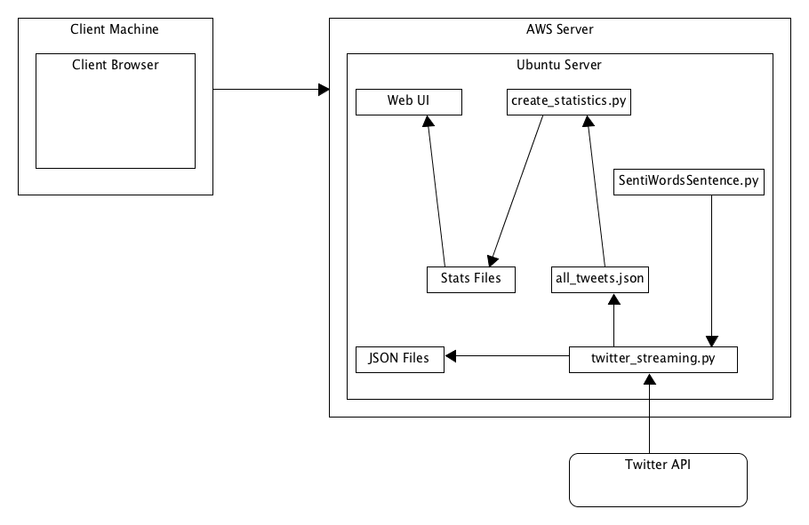
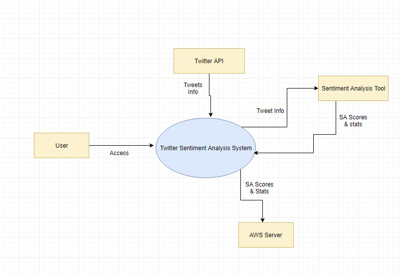
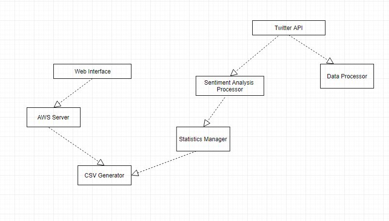
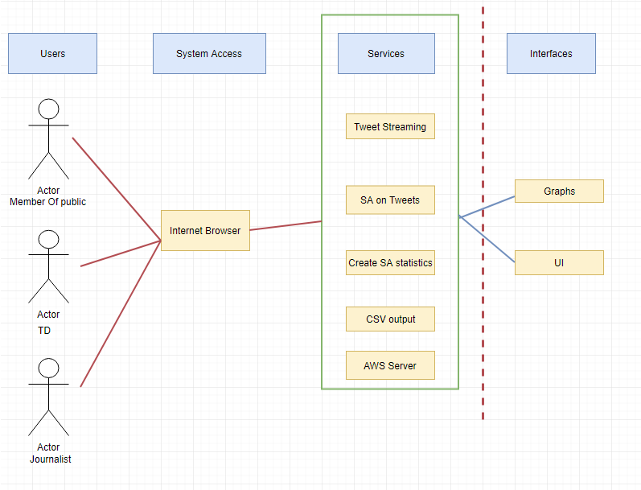
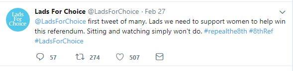
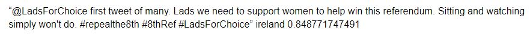

# Sentiment Analysis on 8th Amendment Tweets

### Technical Specification CA326

#### Niall Lyons and Emma O'Keeffe

# Table of Contents
- [1. Introduction](#1-introduction)
  * [1.1 Overview](#11-overview)
  * [1.2 Glossary](#12-glossary)
- [2. System Architecture](#2-system-architecture)
- [3. High-Level Design](#3-high-level-design)
  * [3.1 System Context Diagram](#31-system-context-diagram)
  * [3.2 Component Relationship Diagram](#32-component-relationship-diagram)
  * [3.3 Architectural Overview Diagram](#33-architectural-overview-diagram)
- [4. Implementing Sentiment Analysis Tool](#4-implementing-sentiment-analysis-tool)
- [5. Problems and Resolutions](#5-problems-and-resolutions)  
  * [5.1 ID Assignment](#51-id-assignment)
  * [5.2 Extracting Location Data](#52-extracting-location-data)
  * [5.3 Continuously Running Web Scraper on Server](#53-continuously-running-web-scraper-on-server)
  * [5.4 Noise Reduction on Data](#54-noise-reduction-on-data)
  * [5.5 Generating Charts from the Twitter Data](#55-generating-charts-from-the-twitter-data)
  * [5.6 Updating Charts on the UI through our Webserver ](#56-updating-charts-on-the-UI-through-our-webserver)
- [6. Installation Guide](#6-installation-guide)
  * [6.1 Required Software](#61-required-software)
  * [6.2 Preconditions](#62-preconditions)
  * [6.3 Instructions](#63-instructions)
  * [6.4 Instructions to stop running twitter_streaming.py](#64-intructions-to-stop-running-twitter_streaming.py)

## 1. Introduction
### 1.1 Overview
In the age of technology more and more people are going to the Internet to learn about topics that they are interested in. Not only can online resources help but social media now has a huge impact on hearing other people's opinions. Using hashtags on twitter can guarantee the display of other user's thoughts and opinions. In Ireland, there has been a rumble of discontent for a repeal of the 8th Amendment since 1992 but lay dormant until the death of Savita Halappanavar in 2012. Since then the desire for reform has exploded with the #RepealThe8th hashtag on Twitter aiding in people having their voices heard. This has also encouraged a #Savethe8th hashtag on twitter for users who want the 8th Amendment to remain.

In 2017, Taoiseach Leo Varadkar announced an intention to hold a referendum regarding abortion in 2018. It has since been announced that it will be held in May or June of 2018. With the upcoming referendum, there has been an increase of users discussing the topic with a desire to know how people feel about the upcoming referendum. The project allows users to get a real-time insight to how people are feeling towards the referendum in a visual format using Sentiment Analysis on Tweets collected. 

A web application can be found with through 8thamendmentsa.com. The UI is a simple, three page, scrolling web application where all information can be easily obtained. There are multiple graphs displaying information such as:

* Overall sentiment of the Referendum, positive or negative, in the form of a Pie Chart.
* Statistics on where Tweets are being collected from includining counties and countries in the form of a Pie Charts.
* The amount of Tweets that we have collected in the form of a Bar Chart.

### 1.2 Glossary

**Twitter** - An online news and social networking service where users post and interact with messages, known as "tweets."

**Hashtag** - A word or phrase preceded by a hash sign (#), used on social media websites and applications, especially Twitter, to identify messages on a specific topic.

**Tweet** - A message, image, etc. posted on Twitter.

**Python** - A high-level general-purpose programming language.

**Twitter Streaming API** - Users register a set of criteria (keywords, usernames, locations, named places, etc.) and as tweets match the criteria, they are pushed directly to the user.

**Pip** - A tool for installing Python packages.

**twitter 1.18.0** - An API and command-line toolset for Twitter (twitter.com)

**NTLK** - A leading platform for building Python programs to work with human language data.

**NTLK Data** - dozens of corpora and trained models.

**SA** - (Sentiment Analysis) he process of computationally identifying and categorizing opinions expressed in a piece of text, especially in order to determine whether the writer's attitude towards a particular topic, product, etc. is positive, negative, or neutral.

**Terminal** - A terminal window, also referred to as a terminal emulator, is a text-only window in a graphical user interface (GUI) that emulates a console.

**PID** - Process Identification Number is an identification number that is automatically assigned to each process when it is created on a Unix-like operating system.

**csv** - A simple file format used to store tabular data, such as a spreadsheet or database.

**Client** - A piece of computer hardware or software that accesses a service made available by a server. 

**Server** - An instance of a computer program that accepts and responds to requests made by another program, known as a client.

**AWS** - (Amazon Web Services) Amazon Web Services offers cloud web hosting solutions that provide businesses, non-profits, and governmental organizations with low-cost ways to deliver their websites and web applications.

**Highcharts** - An easy way to include animated, interactive graphs on your website for free.

**UI** - (User Interface) The industrial design field of human–computer interaction, is the space where interactions between humans and machines occur.

**JSON** - (JavaScript Object Notation) The industrial design field of human–computer interaction, is the space where interactions between humans and machines occur.

## 2. System Architecture

 The following diagram is the system architecture diagram. It shows where each part of the web application interacts with one another within the server. The Client accesses the Web UI which displays the statistics through highcharts that reads in the statistics csv files. 
 statistics files have been generated through the execution and processing of the three other python scripts: twitter\_streaming.py, SentiWordsSentence.py and create\_statistics.py. The web scraper twitter\_streaming.py utilises the Twitter API to stream in a constant flow of tweets to form our data. Each tweet is given its own file to store it's JSON data.

## 3. High-Level Design

### 3.1 System Context Diagram

 A system context diagram shows the system as a single high-level process, which shows relationships that the system has with other entities that bring the whole system together. In the diagram above it shows four separate entities that bring the system together, namely the Twitter API, our sentiment analysis tool, an AWS server and a user. We start off with our Twitter API which streams tweets straight into our system where they are stored. We then move onto work with our sentiment analysis tool where it takes the tweet information and return the sentiment and statistics that we are looking for. 
 These are all running continuously on our AWS server which collect tweets every half an hour, while our user is accessing this data through the user interface. 

### 3.3 Component Relationship Model

 A component relationship diagrams main purpose is to show the structural relationships between the components of a system. Above we show how each component interacts with each other. We start at our Twitter API, this component interacts with both the data processor where the tweet data is held and our sentiment analysis processor where that data sentiment is scored. From there our sentiment analysis component interacts with our statistics manager which stores all statistics. From these statistics CSV files are made in the CSV generator 
 to develop our graphs. Our AWS server is constantly running and generating these graphs which in turns generates the web interface.

### 3.2 Architectural Overview Diagram

 An Architectural Overview Diagram describes the key elements of a system including the shape, the structural patterns and the key user interactions. Above we can see our four key elements include users, system access, services and interfaces. Each having a major role to how the system works. Our actors access our system through an internet browser where they can see graphs and in our user interface, while they are seeing this in the background a lot of services are taking place in the backend. 
 Tweets are being streamed live from twitter, which are then stored and scored on sentiment. Statistics are then made from these scores and CSV files generated to develop the graphs, all while running on our AWS server.

## 4. Implementing Sentiment Analysis Tool

To carry out the sentiment analysis on our tweets we used one of Adapts sentiment analysis tools SentiWordsSentence.py. This is a python2.7 script that uses a collection of lexicons to apply a score to the text passed through. It uses a 0.0-1.0 scoring system. A breakdown of the scoring is as follows:

* 0.0-0.3 is high negative
* 0.3-0.5 is negative neutral
* 0.5-0.7 is positive neutral
* 0.7-1.0 is high positive

As there would be a small number of neutral scores we decided to only have two sections in our scoring 0.0-0.5 is negative and 0.5-1.0 is postive. Although English is the most prominent language in Ireland we still wanted to include a lexicon called Senti-Foclóir whish includes Irish words with a sentiment score. This was also produced in the Adapt centre and integrated very easily into SentiWordsSentence.py. 
An example of a tweet that we collected can be seen as follows:

After the our python script extracted the text and location and assigned it an id, the text was scored and the output can be seen below:

It can be seen that the score of the tweet is rounded up to 0.8 which is catagorized as a positive tweet.

## 5. Problems and Resolutions

### 5.1 ID Assignment
We wanted to give an ID to each tweet so we could store the original JSON text in its own file and then store its extracted relevant data in a master file along with the other tweets and relate the two. Originally a variable storing a number that was incremented with each tweet received was used as the ID but this was not very efficient. To give a unique code every time the date and timestamp is strung together. This worked very well until tweets that came in on the same second were named the same which caused overwriting. To solve this the milliseconds were also considered. The ID now follows the format of Year, Day, Month, Hour, Minute, Second, Millisecond.

### 5.2 Extracting Location Data
While beginning the extraction of location data process, it was evident that the majority of tweets did not contain the geotag data that gives a full, easy to read breakdown of the tweet location. It was decided that rather than having only a few locations documented instead inside the user information we could use the location on the user profile. This meant that users who may be living abroad but still intend on voting could be accounted for. To allow Ireland to be concentrated on, the statistics would be broken into Ireland, Other Countries and Null (Null being the user does not have a location on their profile. We then have another chart to show which counties have been tweeting about the Referendum.

### 5.3 Continuously Running Web Scraper on Server
Due to the data being collected in real time, by the Twitter Streaming API, it was essential to have the python script running continuously. Originally, when testing the script would gather a few tweets at a time. Once the results were collecting what we wanted in the desired format, running it on the server became the next feat. It ran continuously no problem on the server however once exiting the server the script would stop. After researching and some localised testing a command called "nohup" could be used along with the script name followed by an "&". This essentially tells the program to ignore the "hang-up" signal sent when we exit the server. This has been an excellent solution to our problem.

### 5.4 Noise Reduction on Data
This problem has only been partly resolved as we can never be sure that every tweet collect only discusses the 8th Amendment Referendum in Ireland. To ensure we don't discard any relevant tweets we decided on what words would be used to filter tweets being collected. This worked at first but we then had to add and remove certain words for example, the word "termination" was bringing in tweets related to the current gun laws in America which had an incline in discussion due to a recent tragic event. We decided to remove that word and have seen a significant reduction in tweets related to American gun laws. However, we are still collecting tweets that have been connected with the current Abortion laws also in America and the American Presidents recent claim that he supports the Anti-Abortion movement. Unfortunately, it is extremely difficult to disregard these tweets as they include many of the same topical words we see in tweets related to the Irish 8th Amendment Referendum.

### 5.5 Generating Charts from the twitter data
At the beginning of this project we used chart.js to develop our graphs. However, we found that the data layout in both the stored JSON data and our CSV files was not able to calculate the type of graphs we wanted and therefore did not fit our system. We then moved on to use a library called Highcharts. In this library we used a data module which parsed our data, which developed the graphs that we wanted to show on our user interface

### 5.6 Updating charts on the UI through our webserver
Due to the permissions that we set on our server initially we were unable to update the graphs every half an hour like planned. We noticed that we had to change our permission settings and when we implemented the changes we could update our graphs the way we intended using crontab.

## 6. Installation Guide 

### 6.1 Required Software

* Python 2.7 and Python 3 - [https://www.python.org/downloads/](https://www.python.org/downloads/)
* Pip - For help installing pip please see: [https://packaging.python.org/tutorials/installing-packages/#requirements-for-installing-packages](https://packaging.python.org/tutorials/installing-packages/#requirements-for-installing-packages)
* twitter 1.18.0 - [https://pypi.python.org/pypi/twitter](https://pypi.python.org/pypi/twitter)
* NLTK - For help installing pip please see: [https://www.nltk.org/install.html](https://www.nltk.org/install.html)
* NTLK Data - For help installing pip please see: [https://www.nltk.org/data.html](https://www.nltk.org/data.html)
* Bootstrap - [https://v4-alpha.getbootstrap.com/getting-started/download/#bootstrap-css-and-js](https://v4-alpha.getbootstrap.com/getting-started/download/#bootstrap-css-and-js)

### 6.2 Preconditions

* The operating System is a Linux or Unix based System.
* Python 2.7 is called in the Terminal using the command python.
* Python 3 is called in the Terminal using the command python3.

### 6.3 Instructions

1. Open a Terminal in the location you would like to clone the gitlab project to.
2. Execute the command: `git clone git@gitlab.computing.dcu.ie:lyonsn4/2018-CA326-nlyons-SentimentAnalysisOf8thAmendmentTweets.git`
3. In the Termianl cd into the cloned folder.
4. Once in the folder execute the command: `cd code`
5. To begin collecting tweets continuously in the background run: `nohup python twitter_streaming.py &`
6. Once run press enter to continue within the Terminal.

### 6.4 Intructions to stop running twitter_streaming.py 

1. Execute command: `top`
2. From the table copy the PID for the command python.
3. Type the PID after the command kill and run it. For example: `kill 123`

