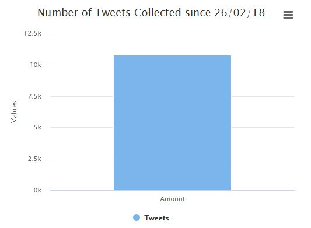

# Sentiment Analysis on 8th Amendment Tweets

### User Manual CA326

#### Niall Lyons and Emma O'Keeffe

# Table of Contents
- [1. About Sentiment Analysis of 8th Amendment Tweets](#1-about-sentiment-analysis-of-8th-amendment-tweets)
- [2. Getting Started](#2-getting-started)
- [3. Eight Amendment Analysis Website](#3-eight-amendment-analysis-website)
  * [3.1 About](#31-about)
  * [3.2 Graphs](#32-graphs)
  * [3.3 Contact](#33-contact)
- [4. Saving or Printing a Graph](#4-saving-or-printing-a-graph)
- [5. Contacting the Owners of the Site](#5-contacting-the-owners-of-the-site)
- [6. Finding how many people are talking about the Eight Amendment](#6-finding-how-many-people-are-talking-about-the-Eight-Amendment)
- [7. County and Country Pie Charts](#7-county-and-country-pie-charts)

## 1. About Sentiment Analysis of 8th Amendment Tweets

Sentiment Analysis on 8th Amendment Tweets gives you the most up to date reference to how the public are feeling about the upcoming 2018 Referendum to Repeal the Eighth Amendment to the Constitution of the Republic of Ireland. In 2017, Taoiseach Leo Varadkar announced an intention to hold a referendum regarding abortion in 2018. It has since been announced that it will be held in May or June of 2018. 

With this Web Application you can experience a real time visual display of statistics regarding the negative or positive sentiment of users tweeting about the referendum. In this user manual you will find instructions on how to access the Web Application, found in the [Getting Started](#2-getting-started) section, and how to understand the graphs displayed. You can find statistics on if Twitter users are writing positive or negative tweets regarding the 8th Amendment as well as where in Ireland people are tweeting about this topic. 

Please enjoy Sentiment Analysis of 8th Amendment Tweets and make an informed decision on your vote for the upcoming Referendum.

## 2. Getting Started

1. Make sure you have a working internet connection.
2. Open your preferred Web Browser e.g. Google Chrome.
3. In the search bar enter the following url: 8thamendmentsa.com
4. Access the website and observe the statistics shown.

## 3. Eight Amendment Analysis Website

After accessing the website through the initial getting started phase you can see the following links in the left-hand side sidebar, 

* About
* Graphs
* Contact

### 3.1 About

This is the initial page that you are directed to after entering the URL. Here you can read about what the Eight Amendment consists of and what information you can view on this website based on tweets in both the Irish and English language. 

### 3.2 Graphs

After reading the about section you can then go and look at the graphs that are provided, by clicking on the graphs link in the left sidebar. Here you can access up to date live graphs covering the Eight Amendment.

### 3.3 Contacts

While this data and statistics are very interesting now and a lot of people have opinions and views, and may in fact want to see more graphs and ask questions about different issues. We have included a contact form where users can enter their details and send us a message which we will receive and the be able to reply to them.

## 4. Saving or printing a graph

1.	Access the website through the URL.
2.	Click on the Graphs link on the left-hand side navigation bar.
3.	Look at each graph and decide which one you would like to download to use in reports or documents etc.
4.	Click on the icon in the top right hand corner of the chosen graph.

    

5.	Here you will be asked if you would like print the chart or save it in one of four given file formats, namely, PNG, JPEG, PDF, SVG.
6.	Click on your desired file format and the graph will then be saved locally on your computer. You will know that your graph is saved in your downloads folder when your screen looks like this.

## 5. Contacting the Owners of the Site

1.	Access the website through the URL.
2.	Click on the Graphs link on the left-hand side navigation bar.
3.	Here you will be able to read who the owners are and where the system was made. 
4.	You will also see a contact form where you can contact the owners which looks like this.

    

5.	Here you can add in your name, your email address, your phone number and your message which you would like to send.

    

6.	After entering your details, you then click the submit button where your details will be sent to the owners.

## 6. Finding how many people are talking about the Eight Amendment

1.	Access the website through the URL.
2.	Click on the Graphs link on the left-hand side navigation bar.
3.	Look at each graph on the right side of the screen labelled, “Number of Tweets Collected Since 26/02/18” 
4.	This graph illustrated how many tweets has been collected since the system has started running.

    

5.	Here you can hover over the bar in the graph which will illustrate the exact number of tweets that have been collected.

    

## 7. County and Country Pie Charts

1.	Access the website through the URL.
2.	Click on the Graphs link on the left-hand side navigation bar.
3.	You will then see two pie charts, one with the title “Tweets Per County” and one with the title “Tweets Per Country”. These two graphs represent the breakdown of Tweets within each county of Ireland and which countries they have come from. 

